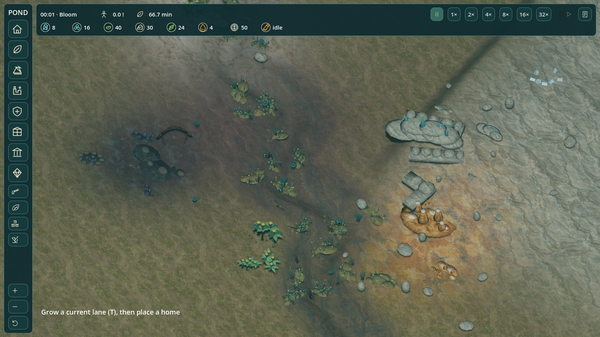
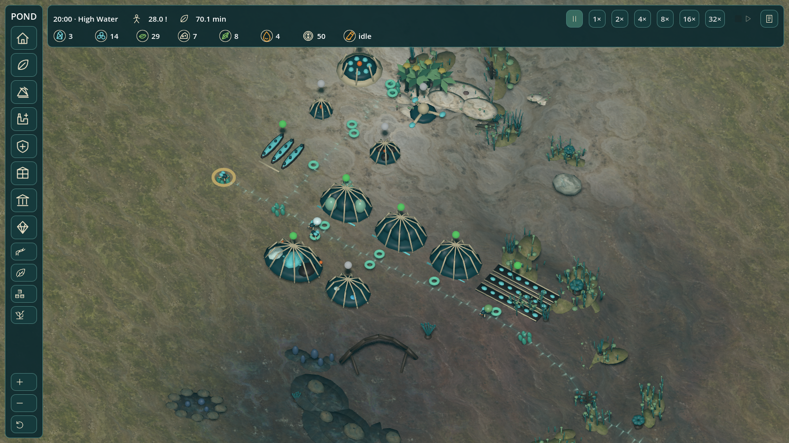

# Current-habitat integration validation — 10 October 2026

The default launch is empty and paused, with the provisional economy, empty founding party, mandatory spatial transport and submerged current-habitat overlays. No free buildings or granted production are used in the opening proofs.

## Reproduced checks

- Local simulation: 223 tests pass.
- Local client: 340 assertions pass after the background-preview correction. Changed cursor/network commands clear approval; unchanged stationary previews retain their previous result during refresh, and stale replies cannot approve another command.
- Claude independently reproduced 223 simulation tests and 337 client assertions on 6fdc454, both opening evidence files and the earlier enzyme-capacity evidence. His full review found no blockers; the identified organ clutter, duplicate advance and preview refresh flicker are corrected. His own status-board patch is on main at 2399336.
- Core ordinary-command opening: ten paid buildings, all 24 founders housed, first Stable at 11:38, no food emergency/devolution through 90 minutes.
- Mineral extension: two additional paid buildings, 19 Raw Silicate and 26 Prepared Silica produced, 172 delivery jobs and 185 collection jobs, no food emergency/devolution through 90 minutes. Shared rock geometry is corrected to actual exported AABB centres; the valid extraction route follows that geography.

## Native renderer evidence

`godot --path client --script res://tools/capture_current_opening.gd` launches an isolated bridge on port 48177 and uses the mineral fixture's ordinary commands. It does not connect to or change the normal game on port 47615. The renderer reached the initial view in 0.73 seconds, confirming current mode, zero residences/sites and paused speed. At 20 minutes it rendered nine commissioned facilities, grown homes and the network with real carrier state.

These are fixture-driven renders, not manual control or novice-player acceptance. The original brief/reference comparison is in BRIEF_REFERENCE_AUDIT_2026-10-06.md. Art remains provisional; local services and geography are implemented, but specialized warehouses, flexible plots, save/load and fluid hazards are not. Upkeep/trade/research/Great Work still account centrally.

## Remaining release gate

Final native control input could not be completed: repeated active-window interruptions, then ScreenCaptureKit stream failure, stopped the desktop-control connection. Rich's existing settlement was preserved. The separate test instance was shut down. A restart preference remains pending; no empty-start reset is inferred from silence. PR #5 stays draft until the manual click-through can verify current drawing, authoritative placement, right-click options, zoom, carrier selection and habitat overlay.

The separate art worktree contains additional library work; this integration does not overwrite or promote those unreviewed candidates.
