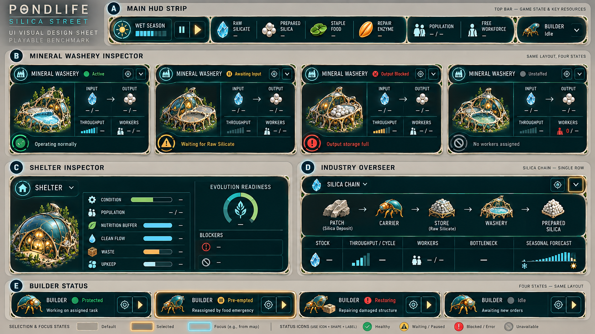

# Silica Street UI component contract v0.1

**Status:** Visual implementation reference
**Authority:** Domain snapshots and diagnostics remain authoritative; this document defines presentation only.

## Component inventory

### Main HUD strip

Required slots, left to right:

1. season, phase progress and pause/speed controls;
2. Raw Silicate;
3. Prepared Silica;
4. Staple food;
5. Repair Enzyme;
6. population and capacity;
7. free workforce;
8. Builder allocation state.

Values come from a single current snapshot. Missing/unavailable values display an em dash; the UI must not silently substitute zero.

### Processor inspector

One component supports all processors. Silica Street must demonstrate:

- `active` — recipe, progress, throughput and staffing visible;
- `awaiting_input` — name the missing input and offer supplier location;
- `output_blocked` — name the blocked output/destination and offer destination location;
- `unstaffed` — assigned/required workers and workforce link;
- `strained` — upkeep/service cause, when supported.

The layout does not jump between states. Status uses icon + label + border treatment; colour is supplementary.

### Residence inspector

Bind directly to the additive residence presentation view:

- `tier`, `condition`, `population`, `capacity`;
- `need_buffer_minutes`;
- `services_for_next_tier`;
- `evolution.target_tier`, `sustain_progress`, `goods_reserved`, `blockers`;
- `expressed_morphologies`;
- upkeep state and reason where relevant.

Condition and individual services are separate. A residence may be normal while an evolution requirement is unmet.

### Industry Overseer row

For the benchmark, one Silica row contains:

- selectable patch/source group;
- carriers currently assigned or transporting the selected resource;
- relevant stores;
- Mineral Washeries;
- Prepared Silica destinations;
- total stock, throughput/cycle, assigned/required workers, principal bottleneck and seasonal forecast.

Each node and diagnostic must carry stable entity IDs or a query token allowing `focus`, `select all` or `open inspector`. Aggregate values may not lose drill-down provenance.

### Builder state chip

Supported states:

| State | Player-facing label | Required reason/action |
| --- | --- | --- |
| `protected` | Protected | assigned site or waiting-for-site reason; locate site when assigned |
| `preempted_food_emergency` | Feeding emergency | food-buffer/shortage reason; open Provisions |
| `restoring` if exposed | Restoring allocation | emergency has cleared; show reassignment pending |
| `idle` | No ready construction | locate queued/blocked sites |
| `disabled` | Allocation disabled | open workforce control |

The concept sheet's sample phrase “repairing damaged structure” under `restoring` is rejected. Restoring refers only to returning protected Builder allocation after emergency pre-emption. If the engine transitions directly from pre-empted to protected, omit the restoring variant.

## Interaction contract

- Hover/focus highlights the matching map entity without moving the camera.
- Primary selection opens its inspector.
- Locate action moves the camera and selects the entity.
- Aggregate locate cycles through or frames all contributing entities.
- Back returns to the previous selection context, not merely the previous panel.
- Warnings order by player consequence: dormant/evolution loss, food emergency, unpaid upkeep, output blockage, input starvation, ordinary inefficiency.

## Accessibility and layout

- Every status uses shape, icon and text; never colour alone.
- Minimum body text target: 16 px at 1920 × 1080 after engine scaling.
- Minimum interactive target: 36 × 36 px, preferred 44 × 44 px.
- Numbers align by decimal/units within tables.
- Resource icons retain a short label on first-level economic views.
- Coral is reserved for actionable failure; amber indicates waiting/attention; cyan focus is not a health state.
- Panel ornament remains outside content columns and cannot change component bounds.

## Fixture requirements

UI verification needs snapshots for:

1. healthy Silica flow;
2. Raw Silicate starvation;
3. Prepared Silica output blockage;
4. Washery worker shortage;
5. Shelter strained and dormant from service failure;
6. recovered service plus Dry season;
7. Builder protected;
8. Builder pre-empted by food emergency;
9. Builder restored or directly protected after the emergency clears;
10. Builder disabled and idle.

Snapshot fixtures should be serialisable, deterministic and usable without running a full 120-minute simulation.

## Generation and correction record

- Mode: built-in image generation.
- Output: `concepts/silica_street_ui_components_v01.png`.
- References: approved Overseer direction and General Carrier turnaround.
- All displayed quantities are placeholders. The image defines hierarchy, component anatomy and visual language, not canonical data.
