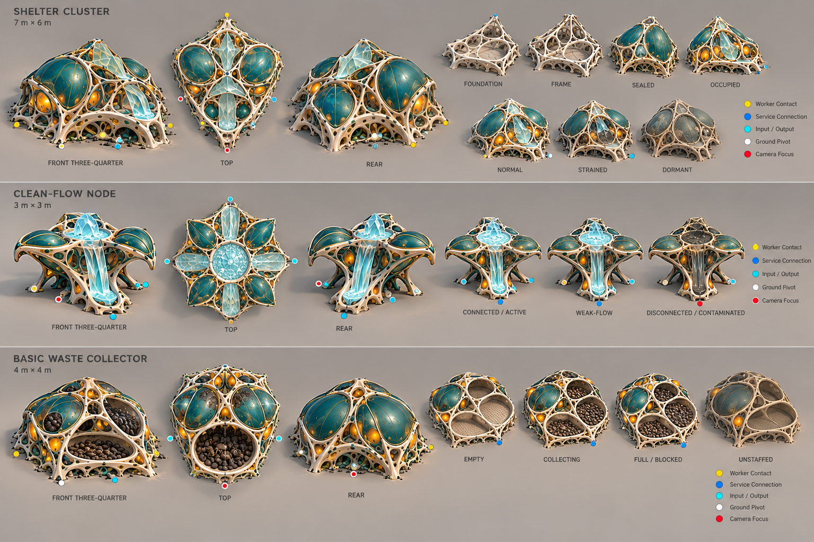

# Silica Street service turnaround review

**Status:** Accepted as modelling direction subject to scale, camera and import review.

## Shelter Cluster

- Preserve the additive foundation → frame → sealed → occupied sequence.
- Normal, strained and dormant are state presentations of one persistent asset, not separate buildings.
- Reduce small lattice holes and ground vegetation by approximately 25% in 3D.
- Amber occupancy organs dim and become irregular under strain; they do not all switch off at once.
- Dormant chambers close but retain recoverable structure. Do not use ruin geometry for ordinary dormancy.
- Service and construction connections must remain visible from the default 45° camera.

## Clean-Flow Node

- The active state reads through moving clear flow and membrane tension.
- Weak flow reduces volume/speed without using a warning tint.
- Disconnected/contaminated closes the upper membrane and darkens the channel locally.
- The concept's waterfall-like front is a process diagram exaggeration. In-world flow must sit close to the substrate and route toward actual service connections.
- Keep the node visually distinct from the Mineral Washery: radial distribution, smaller footprint, no stock shelf.

## Basic Waste Collector

- Three broad collection chambers expose fill level and blockage.
- Use dark brown-black organic matter with wet/rough variation, never generic luminous poison.
- Empty, collecting and full share the same shell; inventory uses fill meshes and controlled surface accumulation.
- Unstaffed means closed/slack service anatomy, not instant disappearance of already stored waste.
- Full/blocked must remain distinguishable from useful stored resources through chamber shape and containment posture.

## Shared production corrections

- Written dimensions in `SILICA_STREET_PRODUCTION_PACKAGE.md` are authoritative.
- Generated anchor dots are illustrative; use the named-anchor contract.
- Verify roof, rear and occlusion at the full yaw matrix.
- Use shared materials and state parameters before unique texture sets.
- Do not derive collision, capacity, staffing or service radius from these images.

## Generation record

- Mode: built-in image generation.
- Output: `silica_street_service_turnarounds_v01.png`.
- References: approved neighbourhood-state board and composite asset turnaround.
