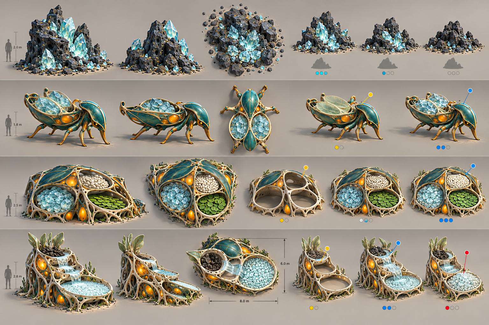
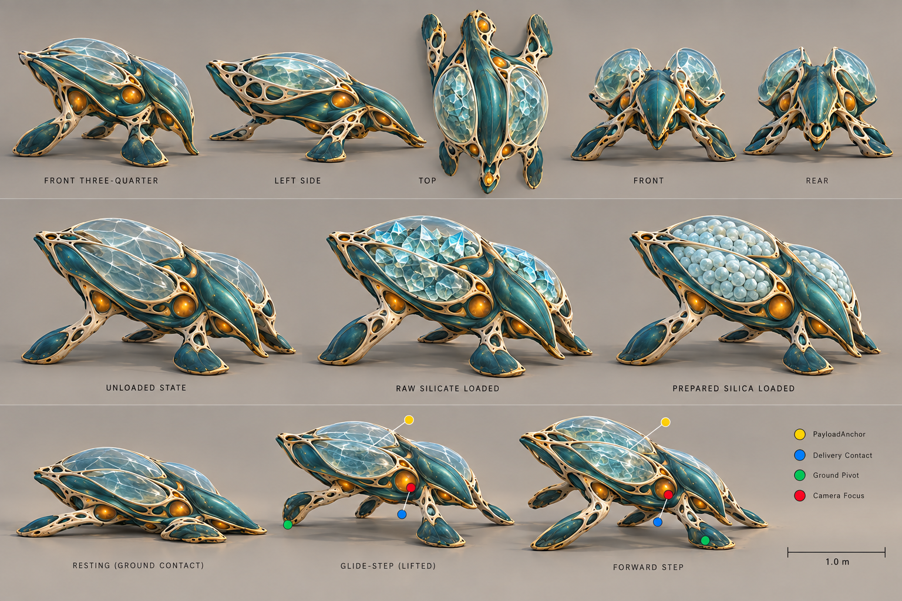

# Silica Street turnaround review

## Composite asset sheet

**Use:** Form and state reference for the Outcrop, General Store and Mineral Washery. The carrier row is superseded by `general_carrier_turnaround_v02.png`.

### Accepted direction

- The Outcrop has a strong host-rock/facet relationship and readable depletion sequence.
- The Store is low, broad and inventory-visible.
- The Washery communicates intake → flow → output through its silhouette.
- Large material zones should survive the settlement camera better than earlier filigree-heavy concepts.

### Required corrections in 3D

- Ignore generated human scale figures and printed dimensions; use `SILICA_STREET_PRODUCTION_PACKAGE.md` as the scale authority.
- Reduce vegetation growing directly from functional assets.
- Give the Store three clearly typed chambers without prescribing the generated contents.
- Make the Washery's input material visibly wet/dirty and its output dry/ordered.
- Use state swaps or controlled fill meshes; do not author a unique building mesh for every stock amount.
- The generated anchor dots are illustrative. Use the exact named-anchor contract in the production package.

## General Carrier v02

**Use:** Accepted modelling target for the first carrier benchmark, subject to in-engine scale and animation review.

### Accepted direction

- A low buoyant mantle and broad contact limbs reduce the terrestrial-insect read.
- Twin integrated cargo membranes make logistics visible without saddlebags or carts.
- Raw fragments and prepared rounded Silica remain identifiable inside the same anatomy.
- Resting, glide-step and forward-contact poses provide a plausible locomotion basis.
- The top, rear and underside receive intentional design treatment.

### Required corrections in 3D

- Hold length to the 1.3 m target; ignore any apparent scale drift in the rendered views.
- Build exactly four principal contact limbs. Small membrane stabilisers may deform but must not read as extra legs.
- Reduce pale lattice perforations by roughly 25% on the production mesh.
- Treat amber organs as activity/breathing accents, not multiple independent lamps.
- Cargo membranes need an opaque/readable fallback for transparency or performance problems.
- Keep the unloaded bladders visibly collapsed; loading must change silhouette at settlement zoom.
- Raw and prepared payloads are separate instanced meshes attached to a stable `PayloadAnchor`, not fused permanently into the carrier.
- Locomotion must be validated over the actual terrain and route width before final rig weighting.

## Generation record

- Mode: built-in image generation.
- Use case: production turnaround concepts.
- Outputs: `silica_street_asset_turnarounds_v01.png`, `general_carrier_turnaround_v02.png`.
- References: approved Verdant benchmark and material-lifecycle concepts.
- These images specify visual intent and state comparison, not topology, UVs, rig structure, collision or balance.
