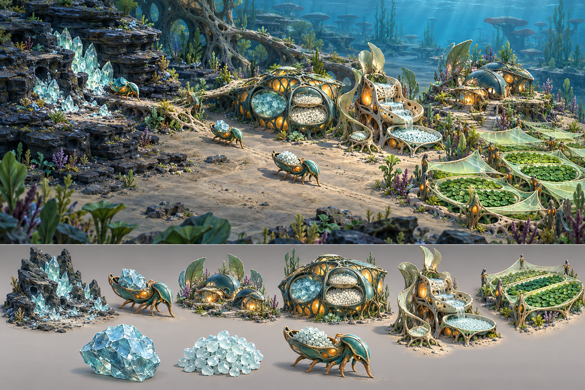

# Verdant benchmark concept v01 — review

**Status:** Directional concept accepted for pre-production; not an asset blueprint.

## What works

- The scene reads immediately as an inhabited underwater basin rather than a decorated flat board.
- Raw Silicate, transported cargo, visible storage and Prepared Silica create a legible material story.
- Teal shell, pale membrane and restrained amber-organ language is coherent across organisms and buildings.
- Storage chambers are visible at normal scene scale.
- The Washery reads through progressive flow basins and a separate output area.
- The Photosynthetic Field reads as cultivation rather than wild background algae.
- The broad central silt route preserves movement space.
- Roofs and upper surfaces are intentionally designed for a high camera.
- Residence and industry share a civilisation while retaining different functions.

## Corrections for 3D production

- Reduce boundary vegetation and micro-detail by roughly 30–40% in the actual benchmark.
- Make the carrier less recognisably crustacean: fewer conventional legs, stronger buoyant body logic and more alien collecting/cargo anatomy.
- Separate General Store and Washery silhouettes further. The concept's store is close to a large residence at first glance.
- Reduce amber windows/cores. Emission must indicate life and activity without appearing on every surface.
- Make the Washery's dirty input visibly distinct from its clean output rather than showing pale material throughout.
- Keep route ribs lower and simpler; the concept's root-like tracks may create navigation clutter if modelled literally.
- Avoid modelling every filigree strand. Convert fine detail into material breakup or a few large ribs.
- Preserve more neutral terrain around the Residence so Habitat Quality/desirability remains visually believable.
- Ensure the Silicate Outcrop has authored depletion stages instead of many unique shards.

## Interpretation rules

- The concept defines mood, hierarchy, material relationships and functional silhouette—not polygon layout.
- The lower strip is a comparative callout lineup, not a demand for separate duplicate assets.
- Painterly vegetation is atmospheric reference; use the approved modular legacy plant library.
- Perspective and scale are provisional until the Godot camera benchmark.
- No gameplay collision, capacity or recipe value may be inferred from the concept.

## Generation record

- Mode: built-in image generation.
- Use case: `stylized-concept`.
- Output: `verdant_benchmark_concept_v01.png`.
- Intent: project-bound visual target for the P0 benchmark.
- No source/reference image was supplied; the prompt was derived from `ART_BIBLE.md` and `VISUAL_BENCHMARK.md`.
