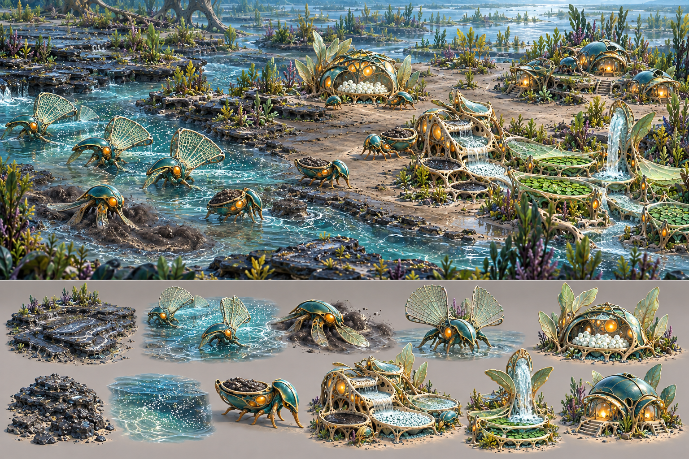
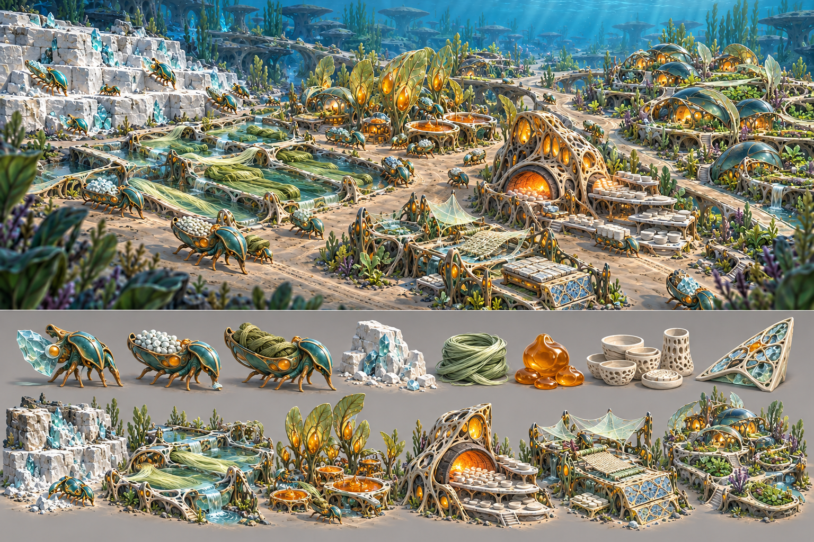
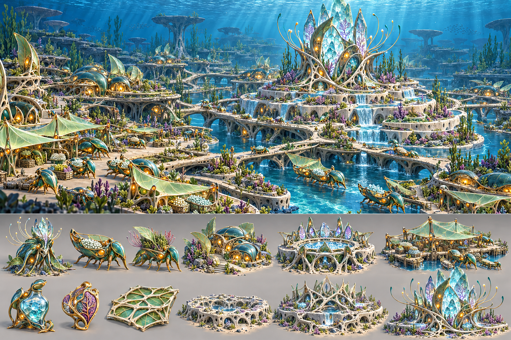

# Verdant civilisation — era progression concepts v0.1

These boards establish one civilisation across changing economic and morphological thresholds. They define artistic continuity and visual escalation, not final content scope or exact gameplay eras.

## Baseline materials economy

The baseline establishes the approved civilisation grammar: deep-teal shell, pale grown lattice, green cultivation, small amber living cores and cyan silica. Its key story is visible extraction, transport, storage and processing.

## Early Settlement threshold

### New environment and economy

- High-Water/recession phosphate wetland;
- layered phosphate sediment;
- suspended-nutrient channel;
- First Nursery and visible brood;
- Nutrient Washer and separated sludge;
- Clean-Flow Node;
- cultivated photosynthetic beds.

### New morphology

- Burrowing Limb: broad paddles and substrate contact;
- Filter Crown: radial porous fans oriented into flow;
- early carriers remain close to the base body plan.

### Visual progression rule

The civilisation is still low, sparse and dependent on natural geography. Buildings are cups, shelters and membranes anchored directly to the substrate. Specialisation appears mainly in organisms rather than monumental architecture.

### Production corrections

- Filter crowns should become more radial/alien and less like conventional butterfly wings.
- Reduce the number of visible legs on all castes.
- The Nursery must not be mistaken for storage; brood need more visibly organic variation than uniform white spheres.
- Maintain more open silt than the painterly board suggests.
- Dark phosphate and sludge require different texture/containment cues.

## Mature Industry threshold

### New environment and economy

- cut carbonate reef;
- organised fibre gardens;
- resin groves and curing organs;
- Ceramic Kiln;
- Composite Workshop;
- repeated low flow channels;
- expanded Symbiotic Neighbourhoods.

### New morphology

- Mineral Jaw: reinforced silica cutting anatomy;
- Vascular Carrier: enlarged cargo vessels and stronger transport ribs;
- differentiated industrial tenders derived from the same base species.

### Visual progression rule

Advancement appears as interdependence and organisation: repeated fields, busy logistics, distinct processing districts and visibly combined materials. It does not introduce metal, engines or human factory architecture.

### Production corrections

- Ceramic vessels in the concept read too human-made; revise toward asymmetrical grown/sintered modules.
- Quarry faces should remain porous carbonate rather than clean masonry blocks.
- Keep industrial heat local; reduce the number of amber-lit openings.
- Roads/routes must be low living channels, not broad paved boulevards.
- A real city needs more negative space between repeated processors than the concept painting.
- Carrier castes require fewer conventional legs and more buoyant locomotion.

## Memory / Planetary threshold

### New environment and economy

- connected civic and trade districts;
- restored ecological terraces;
- controlled currents and regional routes;
- Memory Circle;
- Trade Landing;
- Memory Enclave residences;
- the completed Memory Reef as a territory-scale landmark.

### New morphology

- Memory Ganglion: protected luminous crown and signalling tendrils;
- advanced Vascular Carrier with specialist payloads;
- Detox/steward caste integrated with cultivated ecology.

### Visual progression rule

Late advancement appears as coordination, encoded living surfaces and stewardship at landscape scale. It remains biologically grown and materially traceable. The Memory Reef visibly combines carbonate foundation, fibre/resin lattice, silica archive surfaces and restrained cultural pigment.

### Production corrections

- The board approaches ornate fantasy-palace architecture; production designs must remain biological and process-led.
- Bridges and terraces must arise from flow/logistics needs, not decoration.
- Reduce settlement density and retain large operational clearings.
- Limit crystalline crown scale so the Memory Reef dominates without becoming magical architecture.
- Memory patterns should be subtle living inclusions, not stained glass.
- Trade Landing must show goods handling and route direction more strongly.
- Advanced organisms need more radical neural/sensory morphology while retaining the base shell lineage.

## Cross-era constants

The following do not change:

- deep-teal shell as the lineage anchor;
- pale living lattice as shared structural tissue;
- green tissue for cultivation and regenerative functions;
- amber cores for life/activity only;
- silica cyan for hard knowledge/material capability;
- coral/violet reserved for culture and encoded memory;
- visible cargo and production state;
- fully rounded camera-ready forms;
- quiet central operating space;
- material provenance visible in advanced structures.

## Cross-era escalation

| Dimension | Early Settlement | Mature Industry | Memory/Planetary |
|---|---|---|---|
| Settlement organisation | patch-adjacent clusters | specialised linked districts | regional civic/logistics network |
| Structure height | low cups and domes | larger chambers and kilns | selective civic landmarks |
| Material complexity | shell, membrane, sediment | carbonate, fibre, resin, ceramic, composite | encoded silica, pigment and integrated composites |
| Organism specialisation | extraction organs | production and transport castes | coordination and stewardship castes |
| Route language | natural flow and short tracks | maintained low flow channels | regional current/bridge network |
| Environmental agency | responds to season | manages local conditions | restores and coordinates whole basins |
| Cultural expression | brood and shelter | neighbourhood gardens | memory surfaces and shared Great Works |

## Use in production

- These images are palette, hierarchy, material and silhouette targets.
- They do not establish building counts, footprints, recipes or collision.
- Lower callout strips are design ideation, not guaranteed separate assets.
- All designs still pass through the P0 benchmark and in-engine camera review.
- Do not begin late-era asset production before the Verdant slice is mechanically and visually proven.

## Generation record

- Mode: built-in image generation with `verdant_benchmark_concept_v01.png` as the local species/style reference.
- Use case: `stylized-concept`.
- Outputs:
  - `verdant_early_settlement_v01.png`;
  - `verdant_industrial_v01.png`;
  - `verdant_memory_planetary_v01.png`.
- Intent: project-bound art-direction reference.
