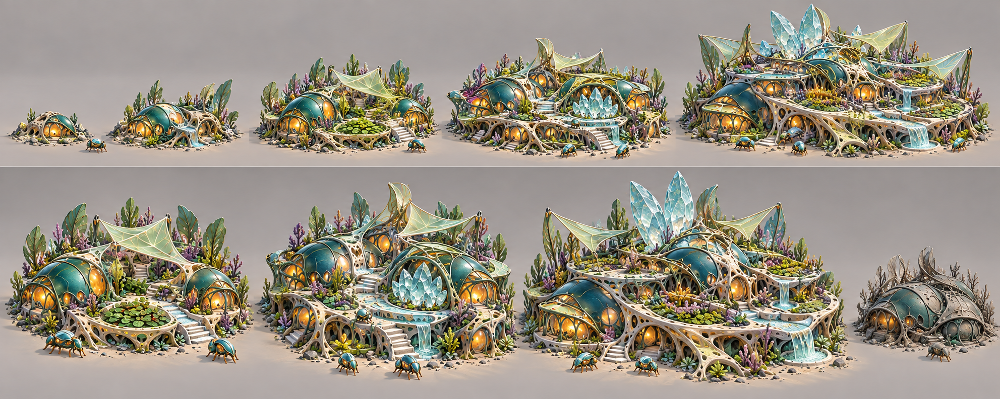
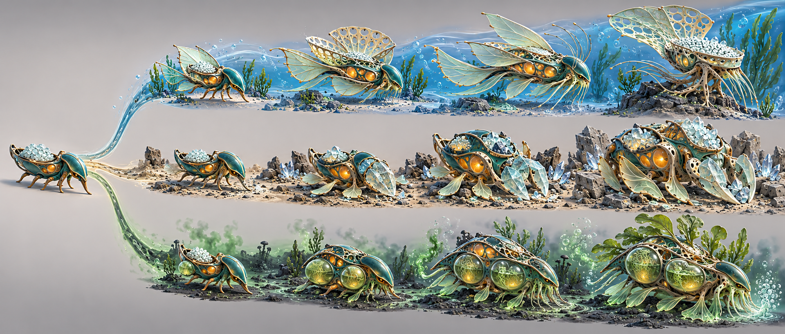
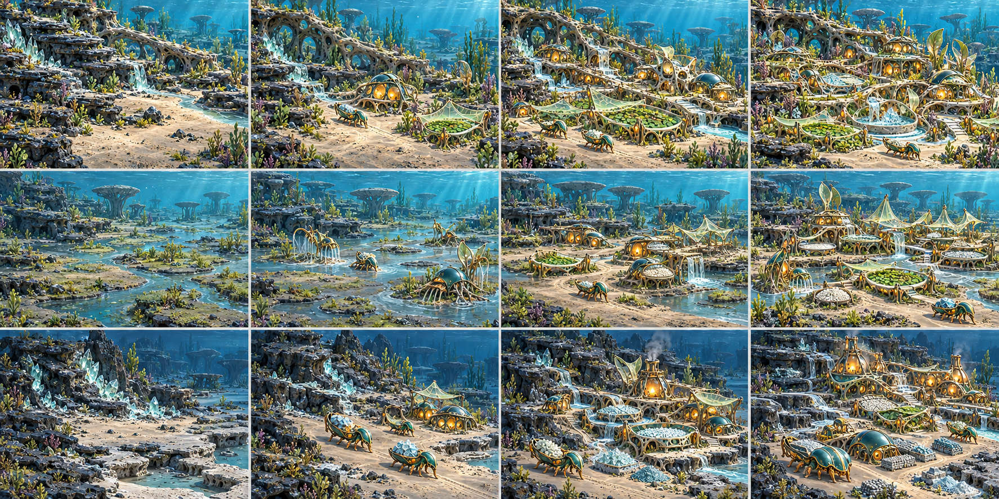

# Verdant evolution and settlement storyboards v0.1

These spreads define three central visual systems: residence evolution, environmentally shaped organism lineages and visible map development. They are artistic/interaction targets, not final numerical progression.

## 1. Residence evolution

### Intended progression

1. **Shelter Cluster:** rough silt/carbonate foundation, one protected living cavity and minimal service tissue.
2. **Stable Habitat:** retained foundation under stronger teal shell, clean-flow connection, additional chamber and cultivated patch.
3. **Symbiotic Neighbourhood:** several related chambers around the original shelter, shared garden/nursery and pale membrane canopy.
4. **Memory Enclave:** silica reinforcement, memory chamber, service connections and restrained pigment culture.
5. **Grand Civic Residence:** mansion-scale communal habitat with courtyards, gardens and cultural surfaces; prosperous rather than royal.

### Pharaoh principle

The residence grows because the city supplies it. Each stage adds visible evidence of goods and services rather than replacing the model after a generic research unlock.

- Nutrition appears as cultivated garden and occupied food chamber.
- Clean Flow appears as inlet, channel and small cascade.
- Waste/maintenance appears as dedicated service tissue and clean substrate.
- Symbiosis/health appears as shared garden and protected secondary chambers.
- Memory/culture appears as silica/pigment encoding and communal space.

### Production corrections

- Preserve more of the original Stage 1 mound in later stages; the current concept becomes architecturally grand too quickly.
- Reduce stairs and human-style entrances. Inhabitants should use sloped living lips, apertures or fluid channels.
- Limit large silica crystals to the Memory Enclave/Grand tier and integrate them as tissue-supported archive surfaces.
- Reduce landscaping clutter so service additions remain readable.
- The strained/dormant form works as a cue, but use closed membranes, dry gardens and dim organs rather than dead grey foliage alone.
- “Grand” means higher capacity, comfort and civic participation—not aristocratic exclusivity unless later social design explicitly calls for it.

## 2. Environmentally shaped creature lineages

One ancestor body branches into three economic/ecological lineages. Player investment makes the choice; repeated activity and environmental pressure reveal it.

### Flow / Filter lineage

- small lateral membranes;
- broader porous fans;
- streamlined body and nutrient sacs;
- final anchored current specialist with controlled radial crown.

Environmental cause: sustained work in nutrient-rich current.

Economic effect: dissolved-resource collection and strong-flow access.

Dependency: clean flow and fouling control.

### Mineral / Industry lineage

- thickened front shell;
- silica-edged jaw plates and paddles;
- grounded mineral worker;
- precise cutting/manipulation caste with cargo integration.

Environmental cause: repeated work against Silicate and Carbonate.

Economic effect: hard-deposit extraction and refined material handling.

Dependency: mineral repair compounds and slower movement.

### Anoxic / Detox lineage

- small chemical-processing sacs;
- sealed paired Detox Sacs;
- protected sensory organs and catalytic tissues;
- environmental steward that removes toxins and releases clean flow.

Environmental cause: exposure to the anoxic basin and chemical processing.

Economic effect: safe hazardous extraction and remediation.

Dependency: catalyst/health upkeep and reduced exposed membrane.

### Production corrections

- The common ancestor must be shown without a white cargo load; cargo is state, not anatomy.
- Top-line fans still resemble insect wings in places. Make them porous feeding tissues with fewer symmetrical wing cues.
- Middle-line final form is too large and crystal-covered; emphasise precise anatomy rather than mineral armour.
- Bottom-line sacs should look physiologically connected and fluid-filled, not glass tanks attached to a vehicle.
- Reduce ordinary walking legs across all paths. Use paddles, anchoring roots, fins and buoyant motion.
- Final forms should remain comparable in visual importance so one path does not look like the obvious “best” evolution.

## 3. Map development timelines

The sheet contains three separate four-stage stories using persistent terrain landmarks.

### Sunlit residential/farming timeline

1. Empty shelf and clean-flow spring.
2. Shelter, Nursery and first Photosynthetic Field.
3. Stable Habitats, organised fields and local distribution.
4. Symbiotic/Memory neighbourhood with civic service and mature gardens.

The district grows around clean flow and desirable cultivation.

### Phosphate wetland timeline

1. Flooded sediment and suspended-nutrient channel.
2. Burrower/Filter foothold.
3. Nutrient processing, storage and routes after recession.
4. Managed fertility district with filters, waste recovery and export surplus.

The changing waterline alters access and settlement form.

### Mineral/industrial timeline

1. Empty Silicate/Carbonate edge.
2. Extraction foothold, carriers and Store.
3. Washery, Kiln and connected material inputs.
4. Integrated materials district with depleted outcrop, Composite production and turbidity boundary.

The district follows deposits and logistics rather than residential desirability.

### Production corrections

- Preserve exact landmark silhouettes and camera framing between panels when producing real storyboards; generated panels drift slightly.
- Keep Stage 4 buildable space more open, especially in the residential row.
- Industrial routes should remain living channels rather than broad pale roads.
- Show depletion/regeneration states more explicitly in the resource patches.
- Make service and waste infrastructure visible in mature panels; growth must not appear to be buildings alone.
- Stage transitions need a consistent population/route density scale.

## System rules established by the spreads

- Evolution is additive and legible.
- Environment reveals possibilities; player investment commits to them.
- Economic capability changes anatomy.
- Residence status is visible in the world.
- A developed map retains its original geography and history.
- Different chemistry creates different city layouts.
- Advancement increases organisation and interdependence before ornament.
- All paths retain a shared civilisation/species language.

## Generation record

- Mode: built-in image generation.
- Reference: `verdant_benchmark_concept_v01.png` supplied as the local style/species input.
- Use case: `stylized-concept`.
- Outputs:
  - `verdant_residence_evolution_v01.png`;
  - `verdant_creature_evolution_paths_v01.png`;
  - `verdant_map_timelines_v01.png`.
- Intent: project-bound art and interaction references.
